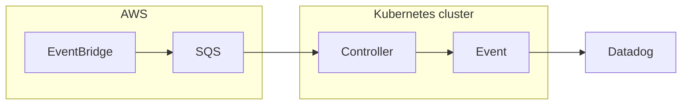

# spot-handler [](https://github.com/int128/spot-handler/actions/workflows/go.yaml)

This is a Kubernetes controller for the observability of spot interruptions.
It provides the Kubernetes events for the [Amazon EC2 Spot Instance interruption notices](https://docs.aws.amazon.com/AWSEC2/latest/UserGuide/spot-instance-termination-notices.html).

## Features

### Observability of spot interruptions

When a spot interruption occurs, it may cause a problem such as network error.
It is very important to measure the number of affected nodes or pods.

This controller provides the following events in Kubernetes:

- `SpotInterrupted` event on `Node` resource
- `SpotInterrupted` event on `Pod` resource

### Pod termination handler

When a spot interruption occurs, possibly a pod is not gracefully terminated.
For example, a pod disruption budget (PDB) may prevent the pod from being deleted.

This controller can delete the affected pods to initiate the graceful termination.

## Getting Started

You need to set up an EventBridge rule and an SQS queue to receive the spot interruption messages.



Deploy the manifest from the GitHub Releases.

Configure the Queue resource with the SQS URL.

```yaml
apiVersion: spothandler.int128.github.io/v1
kind: Queue
metadata:
  name: eks-spot-handler
spec:
  url: https://sqs.us-east-2.amazonaws.com/123456789012/eks-spot-handler
```
