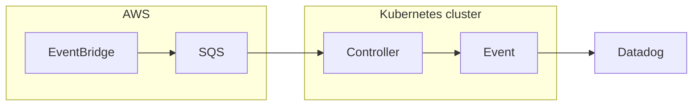

# spot-handler 

This is a Kubernetes controller to receive [Amazon EC2 Spot Instance interruption notices](https://docs.aws.amazon.com/AWSEC2/latest/UserGuide/spot-instance-termination-notices.html) and emit Kubernetes events.

## Purpose

When a spot interruption occurs, it may break production service such as a network error.
It is important to measure the number of affected nodes or pods.
For now, Karpenter does not provide that metrics.

This controller provides the Kubernetes events of the following resources:

- Node affected by a spot interruption.
- Pod affected by a spot interruption.

You can set up your SLO based on the number of affected nodes or pods.

## How it works

This controller receives a spot interruption from EventBridge via SQS.

